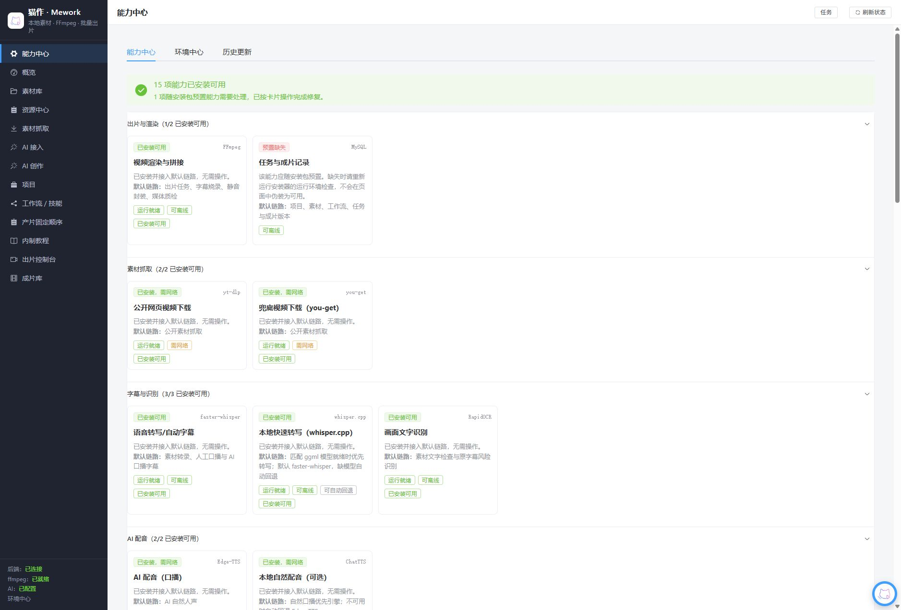

# 猫作·Mework

前端 Vue 3 + 后端 Spring Boot 3（Java 17）+ MySQL 8 + ffmpeg。将一组已授权的本地素材、产品信息和受约束工作流，批量生成 50–150 秒的短视频混剪。



> 本项目默认仅供本机使用。素材版权、肖像权、平台条款和商业授权由使用者负责确认。

## 当前进展

当前开发版本为 `2.2.150`。最近完成了媒体能力路由、音频合同与响度质检、渲染前置检查、AI 媒体适配器、任务恢复与取消、资产识别交接，以及 D 盘启动器和安装验证流程。

完整开发提交记录见 [`docs/zcode-handoff/GIT_HISTORY.md`](docs/zcode-handoff/GIT_HISTORY.md) 及 GitHub 的 [`legacy-history-sanitized` 分支](https://github.com/pengzexi79-ops/mao-zuo-mework/tree/legacy-history-sanitized)；`main` 是可直接分享的最新源码快照。

## 功能概览

```text
[AI 钩子] → [实拍/明星素材切片，均匀插入产品段] → [片尾]
                            ↓
                BGM/可选口播 + 字幕 + ffmpeg 渲染
```

不同 `variant` 会移动切片起点，减少批量出片的重复。计划会在渲染前生成，方便人工检查时间线、时长和素材分配。

## 前置条件

| 依赖 | 是否必需 | 说明 |
| --- | --- | --- |
| JDK 17+ | 是 | 运行后端 |
| MySQL 8 | 是 | 数据库 |
| ffmpeg / ffprobe | 是 | 渲染和媒体探测；均需在 PATH 中 |
| Node 18+ | 否 | 仅修改前端时需要 |
| yt-dlp / you-get | 否 | 仅网页公开素材抓取时需要 |

## 本机启动

1. 初始化新数据库（可重复执行）：

   ```bash
   mysql -uroot -p < backend/src/main/resources/db/schema.sql
   ```

2. 创建权限最小化的本地数据库用户，并把真实密码配置为环境变量。不要使用 README 中的示例密码，也不要提交密码：

   ```sql
CREATE USER IF NOT EXISTS 'mixcut'@'localhost' IDENTIFIED BY '请替换为强密码';
GRANT ALL PRIVILEGES ON ai_mix_video.* TO 'mixcut'@'localhost';
   FLUSH PRIVILEGES;
   ```

   复制 [`.env.example`](.env.example) 为项目根目录的本机 `.env` 后填写 `DB_PASSWORD`。Spring Boot、IDE 和 [`start.bat`](start.bat) 都会读取该文件；不要提交它。

3. 双击项目根目录的 [`start.bat`](start.bat)。脚本会检查 `java`、`ffmpeg` 和 `ffprobe`，随后优先启动 `backend/target/mixcut-delivery.jar`，不存在时回退到 `mixcut.jar`。

   默认服务仅绑定 `127.0.0.1:8760`，访问 <http://127.0.0.1:8760/>。如需同一 Wi-Fi 的手机访问，必须在本机 `.env` 同时设置 `APP_BIND_ADDRESS=0.0.0.0` 和一个足够长的 `APP_ACCESS_TOKEN`；随后用启动器输出的电脑局域网地址加 `?access_token=...` 打开。不要把此服务暴露到公网。

手动启动：

```bash
cd backend
mvn package -Ddelivery.jar.name=mixcut-delivery
java -jar target/mixcut-delivery.jar --server.port=8760 --server.address=127.0.0.1
```

## 配置、令牌与 CORS

后端默认值在 [`backend/src/main/resources/application.yml`](backend/src/main/resources/application.yml)，所有密钥应通过环境变量或本机未提交配置提供。

| 环境变量 | 用途 |
| --- | --- |
| `DB_URL` / `DB_USERNAME` / `DB_PASSWORD` | MySQL 连接；生产或共享机器必须设置强密码 |
| `APP_BIND_ADDRESS` | 默认 `127.0.0.1`；仅配合 `APP_ACCESS_TOKEN` 才可显式设为 `0.0.0.0` 供同 Wi‑Fi 手机访问 |
| `APP_ACCESS_TOKEN` | 非空时保护 `/api/**` 和 `/files/**`；局域网监听时为必填 |
| `APP_CORS_ALLOWED_ORIGINS` | 精确、逗号分隔的浏览器 Origin 白名单 |
| `APP_FREESOUND_API_KEY` / `APP_PIXABAY_API_KEY` | 可选官方素材目录 API Key |
| `APP_ALLOW_LOGIN_CRAWL` | 登录态站点抓取开关；默认 `false` |

CORS 开启凭据模式，因此 `APP_CORS_ALLOWED_ORIGINS` 必须是明确 Origin，例如 `http://localhost:5273,http://127.0.0.1:5273`；不得使用 `*`。内置页面与 API 同源运行时无需额外配置 CORS。

`.env`、本地 application 覆盖文件、运行数据、构建产物和前端依赖均已由 [`.gitignore`](.gitignore) 排除。不要把令牌、数据库密码、浏览器 Cookie 或第三方 API Key 写入 `start.bat`、README 或 Git。

## 首次出片

1. 在「素材库」指定本机目录并扫描；可按 `hook`、`body`、`celebrity`、`product`、`endcard`、`voice`、`bgm` 标记素材。
2. 在「项目」新建品牌、产品、卖点与受众信息。
3. 按需在「AI 接入」添加模型供应商。AI 调用失败会回退，不应阻塞本地渲染。
4. 在「出片控制台」先预览第 N 条时间线，再提交批量渲染。
5. 在「成片库」播放或下载结果。

常用参数：`minSec` / `maxSec` 约束时长；`sliceSec`、`sliceJitter` 和 `maxSlicesPerMaterial` 控制切片；`celebrityRatio`、`productSlots` 和 `productSec` 控制结构；`bgmVolume` 控制配乐音量。

## 公开素材抓取与合规

网页抓取仅面向用户有权访问和使用的**公开** `http/https` 链接。服务端会拒绝 `localhost`、私网、保留地址、非 HTTP 协议和重定向到这些地址的目标，以防 SSRF。

- 不会自动读取、导入或保存浏览器 Cookie。
- 默认不抓取必须登录的平台；`APP_ALLOW_LOGIN_CRAWL=false` 是默认安全状态。
- 运行 Windows 批处理请使用 `start.bat` 或 `cmd.exe /c`，不要在 Git Bash 中用重定向创建文件，避免生成设备名文件（如 `nul`）。
- 即使明确开启该开关，也应自行确认平台条款、下载权限、版权、肖像授权与商用范围。
- 明星片段、影视片段和第三方素材是高风险内容，商用前必须取得相应授权。

## Skill DSL 与工作流安全

内置工作流可调用 `select_materials`、`set_duration`、`set_slice`、`set_structure`、`gen_hook`、`gen_script`、`pick_audio`、`set_canvas`、`fetch_web_video` 和 `fetch_audio_library`。

自定义 `script` / `ai` Skill 不是可执行脚本，而是受约束的 JSON DSL：

```json
{
  "version": 1,
  "steps": [
    {"op": "select_materials", "roles": ["body", "product"], "keyword": "", "limit": 100},
    {"op": "set_params", "params": {"minSec": 50, "maxSec": 90, "sliceSec": 3}},
    {"op": "note", "text": "产品段均匀插入主体"}
  ]
}
```

DSL 仅允许 `select_materials`、`set_params`、`set_hook`、`set_script`、`pick_audio`、`note` 六种操作。命令、shell、URL、HTTP、下载、模板、文件路径及未知字段会被拒绝；AI 不能生成或执行 ffmpeg 命令。

## 任务恢复

渲染任务使用事务提交后派发、活动心跳、总超时和僵死检测：

- `job.timeout_sec`、`job.stale_after_sec` 为单任务覆盖值；`0` 表示应用级默认值。
- `job.last_activity_at` 是 watchdog 的恢复依据。
- 重启前已写入的 `job_output(job_id, idx)` 检查点由唯一索引保护，已完成输出不会重复记录。
- 如任务因本机重启或 ffmpeg 故障失败，请在页面检查错误和输出文件后重新提交未完成任务；不要手工删除检查点来“恢复”。

## 数据库升级（已有 V1 数据库）

新库使用 `schema.sql`。已有数据库请在备份完成、应用停止写入或低峰期执行：

```bash
mysql -uroot -p < docs/UPGRADE_V1_TO_V2.sql
```

该脚本安全、幂等地补充 `job` 可靠性字段、`job_output(job_id, idx)` 唯一索引和 `material(file_path)` 索引；不重建表、不新增外键，也不会删除历史记录。若历史 `job_output` 存在重复 `(job_id, idx)`，脚本会列出重复组并跳过唯一索引创建；请备份、人工核对处理后再重新执行升级。

旧版 [`backend/src/main/resources/db/reliability-migration.sql`](backend/src/main/resources/db/reliability-migration.sql) 仍可用于仅补任务可靠性字段；交付与升级统一以 `docs/UPGRADE_V1_TO_V2.sql` 为准。

## 前端开发

```bash
cd frontend
npm install
npm run dev
npm run build
```

`npm run build` 会先生成一组完整的静态资源并校验 `index.html` 引用，随后再执行后端 `mvn package`。应用只从 `http://127.0.0.1:8760/` 提供的最新 Jar 使用前端；`5273` 仅用于正在运行的 Vite 开发服务器。

Vite 开发服务器默认使用 `http://localhost:5273` 并代理后端；若修改端口，需同步更新 `APP_CORS_ALLOWED_ORIGINS`。

## 测试

不启动服务或访问网络的最小后端验证：

```bash
cd backend
mvn test
```

其中 `UrlGuardTest` 使用纯 URI 语法检查和地址分类断言，不依赖公网 DNS；生产 `UrlGuard.validate` 仍会在实际抓取前解析所有 DNS 结果并拦截私网/保留地址。

## 目录结构

```text
ai-douyin-mixcut/
├── backend/                         Spring Boot 后端
│   ├── src/main/resources/db/
│   │   ├── schema.sql               新库幂等建库脚本
│   │   └── reliability-migration.sql
│   └── src/test/java/               离线单元测试
├── docs/
│   ├── ARCHITECTURE.md
│   └── UPGRADE_V1_TO_V2.sql         现有数据库安全升级脚本
├── frontend/                        Vue 3 + Vite 前端
├── .env.example                     不含真实机密的环境变量模板
└── start.bat                        本机回环地址启动脚本
```
