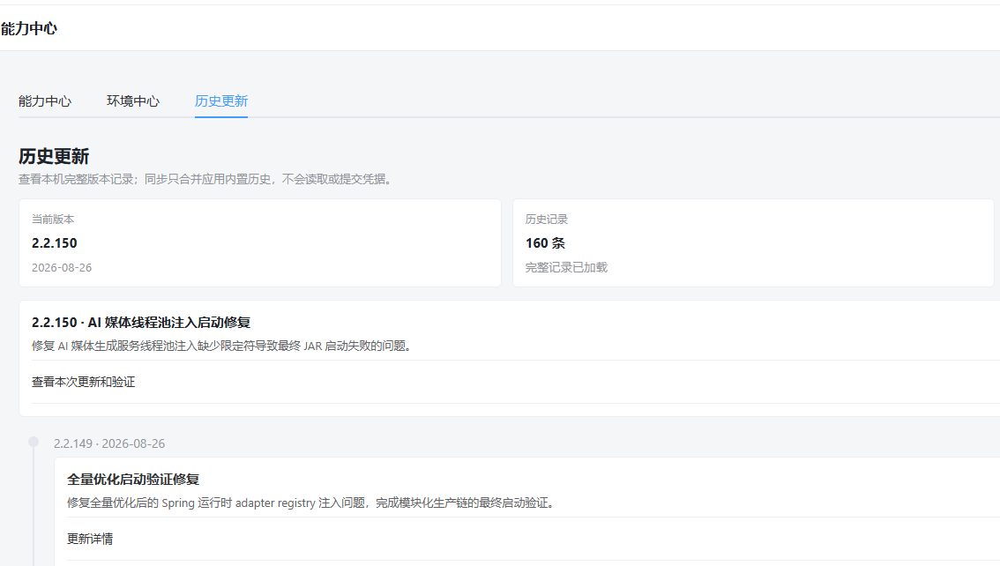
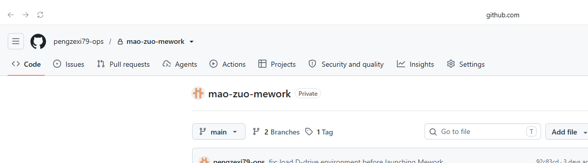
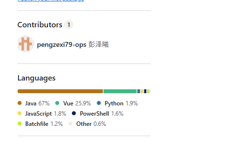
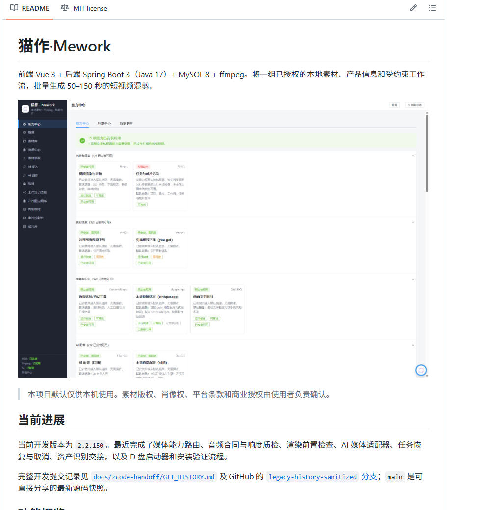

# 猫作·Mework 仓库与应用记录截图

截图来自 2026-08-29 的本地应用和 GitHub 私人仓库页面，仅作为仓库内容和界面状态的视觉记录。可执行能力、运行状态和历史记录以源码、测试和文档为准。

## 应用历史更新页

能力中心显示版本、历史条目和更新验证入口。完整源码历史另见 [`zcode-handoff/GIT_HISTORY.md`](zcode-handoff/GIT_HISTORY.md)。

## GitHub 仓库概览

仓库地址：[pengzexi79-ops/mao-zuo-mework](https://github.com/pengzexi79-ops/mao-zuo-mework)

## GitHub 语言统计

仓库以 Java、Vue、Python、JavaScript、PowerShell 和批处理脚本为主，符合 Spring Boot + Vue + 本地媒体工具的实际结构。

## README 展示页

README 已更新为按产品能力、AI 请求链路、出片质量闭环、安装方式和安全边界组织的项目说明。
